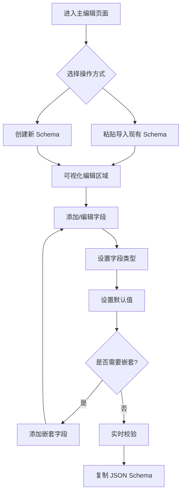

# Fox Json Schema Editor 产品需求文档

## 1. Product Overview
Fox Json Schema Editor 是一个基于 Vue3 的 JSON Schema 可视化编辑器，旨在简化 JSON Schema 的创建和编辑过程。
通过直观的可视化界面，用户可以轻松创建、编辑和验证 JSON Schema，提高开发效率和准确性。
该产品面向需要处理 JSON Schema 的开发者和数据架构师，帮助他们快速构建标准化的数据结构定义。

## 2. Core Features

### 2.1 Feature Module
我们的 JSON Schema 编辑器包含以下主要页面：
1. **主编辑页面**：左右分栏布局、JSON 原文显示区域、可视化编辑区域、工具栏操作区域。

### 2.2 Page Details

| Page Name | Module Name | Feature description |
|-----------|-------------|---------------------|
| 主编辑页面 | 左侧 JSON 原文区域 | 显示 JSON Schema 原文，支持语法高亮和层级格式化显示，支持粘贴输入功能 |
| 主编辑页面 | 右侧可视化编辑区域 | 提供可视化的 Schema 编辑界面，支持 Number、Integer、String、Boolean、Array、Object 六种数据类型的编辑 |
| 主编辑页面 | 嵌套结构编辑 | 支持 Array 和 Object 类型的无限层级嵌套编辑，提供添加、删除、修改嵌套属性功能 |
| 主编辑页面 | 默认值设置 | 为每个字段提供可选的默认值设置功能，空值表示无默认值 |
| 主编辑页面 | 工具栏操作 | 提供快捷复制 JSON Schema 原文、粘贴导入、清空重置等操作按钮 |
| 主编辑页面 | Schema 校验 | 实时校验 JSON Schema 的语法正确性和结构完整性，显示错误提示信息 |

## 3. Core Process
用户首先进入主编辑页面，可以通过粘贴功能导入现有的 JSON Schema，或者从空白开始创建新的 Schema。在右侧可视化编辑区域，用户可以添加各种类型的字段，设置字段属性和默认值。对于 Array 和 Object 类型，用户可以继续添加嵌套的子字段。编辑过程中，左侧会实时显示格式化的 JSON Schema 原文，并进行语法校验。完成编辑后，用户可以通过工具栏快捷复制最终的 JSON Schema。

## 4. User Interface Design
### 4.1 Design Style
- 主色调：#18a058（绿色），辅助色：#f0f0f0（浅灰）
- 按钮样式：方形按钮，hover 效果，无圆角
- 字体：系统默认字体，代码区域使用等宽字体
- 布局风格：左右分栏布局，卡片式组件设计
- 图标风格：简洁的线性图标，支持操作提示
- 样式风格：直角边框，无圆角

### 4.2 Page Design Overview

| Page Name | Module Name | UI Elements |
|-----------|-------------|-------------|
| 主编辑页面 | 左侧 JSON 原文区域 | 深色背景代码编辑器，语法高亮，行号显示，滚动条样式优化 |
| 主编辑页面 | 右侧可视化编辑区域 | 白色背景，卡片式字段编辑器，拖拽排序支持，折叠展开动画 |
| 主编辑页面 | 工具栏 | 顶部固定工具栏，按钮组布局，图标+文字组合 |
| 主编辑页面 | 状态提示 | 底部状态栏显示校验结果，错误信息红色高亮显示 |

### 4.3 Responsiveness
产品采用桌面优先设计，支持响应式布局适配不同屏幕尺寸，在移动端提供基础的查看和简单编辑功能。