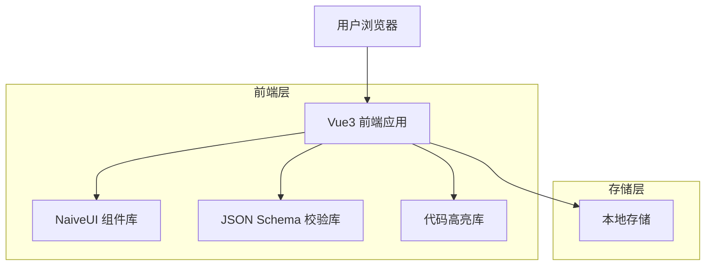
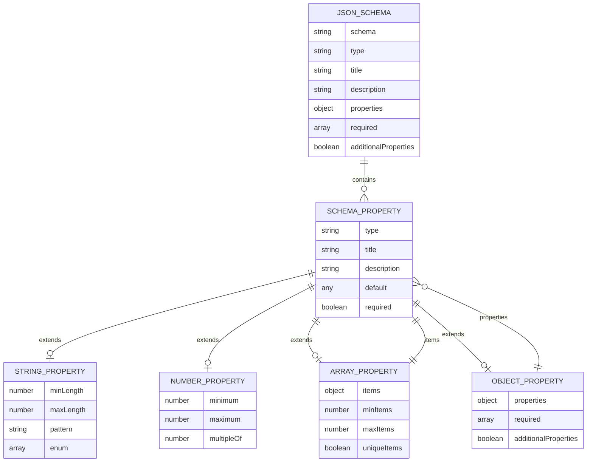

# Fox Json Schema Editor 技术架构文档

## 1. Architecture design



## 2. Technology Description

* 前端：Vue3\@3.3+ + TypeScript\@5.0+ + Vite\@4.0+

* UI 框架：NaiveUI\@2.34+

* 代码高亮：Monaco Editor 或 CodeMirror

* JSON Schema 校验：Ajv\@8.0+

* 构建工具：Vite + TypeScript

* 包管理器：pnpm

## 3. Route definitions

| Route | Purpose                          |
| ----- | -------------------------------- |
| /     | 主编辑页面，提供 JSON Schema 的可视化编辑和预览功能 |

## 4. API definitions

### 4.1 Core Types

```typescript
// JSON Schema 基础类型定义
interface SchemaProperty {
  type: 'string' | 'number' | 'integer' | 'boolean' | 'array' | 'object'
  title?: string
  description?: string
  default?: any
  required?: boolean
}

// 字符串类型扩展
interface StringProperty extends SchemaProperty {
  type: 'string'
  minLength?: number
  maxLength?: number
  pattern?: string
  enum?: string[]
}

// 数字类型扩展
interface NumberProperty extends SchemaProperty {
  type: 'number' | 'integer'
  minimum?: number
  maximum?: number
  multipleOf?: number
}

// 数组类型扩展
interface ArrayProperty extends SchemaProperty {
  type: 'array'
  items: SchemaProperty
  minItems?: number
  maxItems?: number
  uniqueItems?: boolean
}

// 对象类型扩展
interface ObjectProperty extends SchemaProperty {
  type: 'object'
  properties: Record<string, SchemaProperty>
  required?: string[]
  additionalProperties?: boolean
}

// 完整的 JSON Schema 结构
interface JsonSchema {
  $schema?: string
  type: 'object'
  title?: string
  description?: string
  properties: Record<string, SchemaProperty>
  required?: string[]
  additionalProperties?: boolean
}

// 编辑器状态
interface EditorState {
  schema: JsonSchema
  selectedProperty?: string
  validationErrors: ValidationError[]
  isDirty: boolean
}

// 校验错误
interface ValidationError {
  path: string
  message: string
  severity: 'error' | 'warning'
}
```

## 5. Server architecture diagram

由于本项目为纯前端应用，无需服务端架构。所有功能均在浏览器端实现。

## 6. Data model

### 6.1 Data model definition



### 6.2 Data Definition Language

本项目使用前端本地存储，主要数据结构如下：

```typescript
// 本地存储的数据结构
interface LocalStorageData {
  // 最近编辑的 Schema 列表
  recentSchemas: {
    id: string
    name: string
    schema: JsonSchema
    lastModified: number
  }[]
  
  // 用户偏好设置
  preferences: {
    theme: 'light' | 'dark'
    fontSize: number
    autoSave: boolean
    showLineNumbers: boolean
  }
}

// 默认的空 Schema 模板
const DEFAULT_SCHEMA: JsonSchema = {
  $schema: 'http://json-schema.org/draft-07/schema#',
  type: 'object',
  title: 'Root Schema',
  description: 'The root schema comprises the entire JSON document.',
  properties: {},
  required: [],
  additionalProperties: false
}

// 各类型字段的默认模板
const PROPERTY_TEMPLATES = {
  string: {
    type: 'string',
    title: 'String Field',
    description: 'A string field'
  },
  number: {
    type: 'number',
    title: 'Number Field',
    description: 'A number field'
  },
  integer: {
    type: 'integer',
    title: 'Integer Field',
    description: 'An integer field'
  },
  boolean: {
    type: 'boolean',
    title: 'Boolean Field',
    description: 'A boolean field'
  },
  array: {
    type: 'array',
    title: 'Array Field',
    description: 'An array field',
    items: { type: 'string' }
  },
  object: {
    type: 'object',
    title: 'Object Field',
    description: 'An object field',
    properties: {},
    required: []
  }
}
```

